# 

## Modelo de Prototipo

Para a elaboração da estrutura foi utilizado o software Sktechup para web.

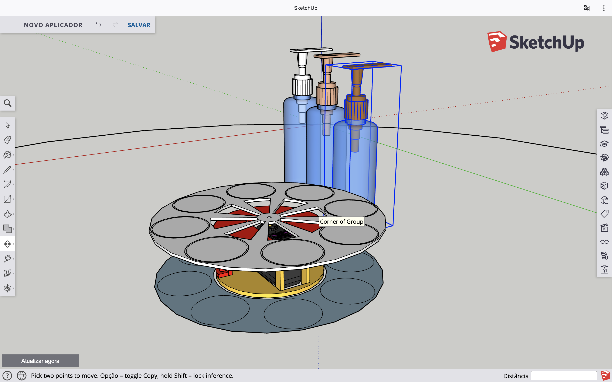

### Lista de componentes físicos
- Recipientes de aplicatores (Natura TODODIA Macadâmia, Frutas Vermelhas e Algodão)
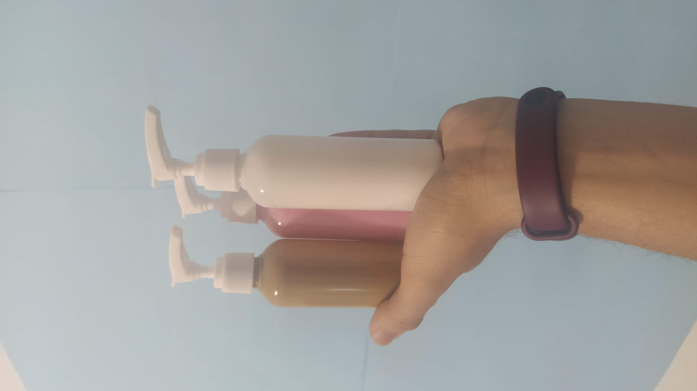 

- Servo motores mg996r 15kg (selecionar os frascos e ejetar o creme)
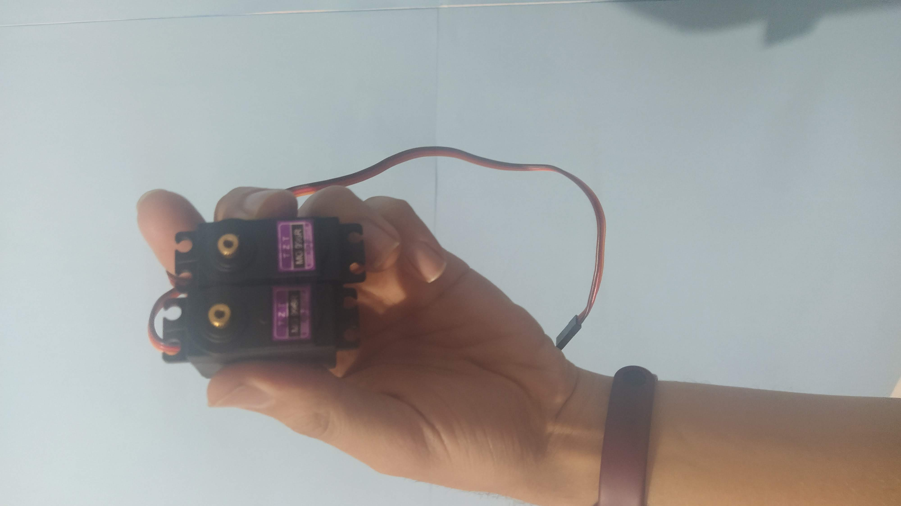 

- Sensor LDR (sentir a proximidade das mãos)
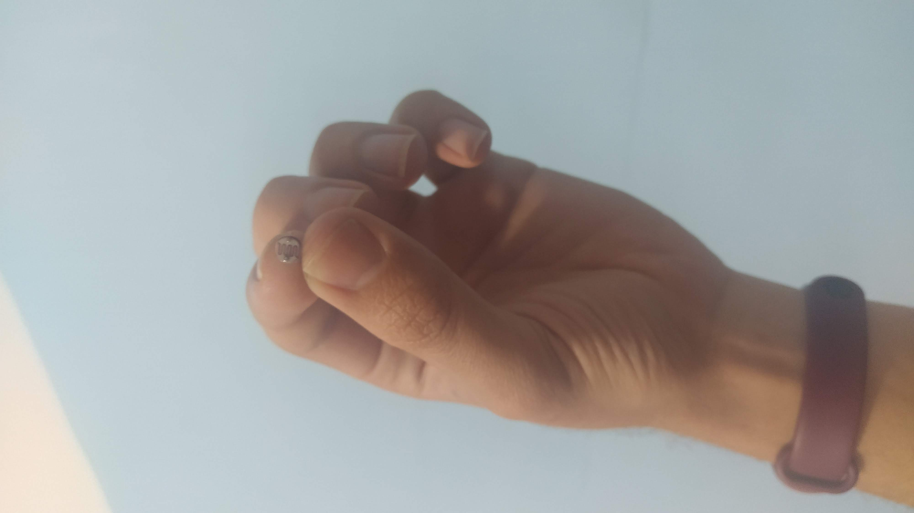 

- Led (calibrar o sensor LDR)
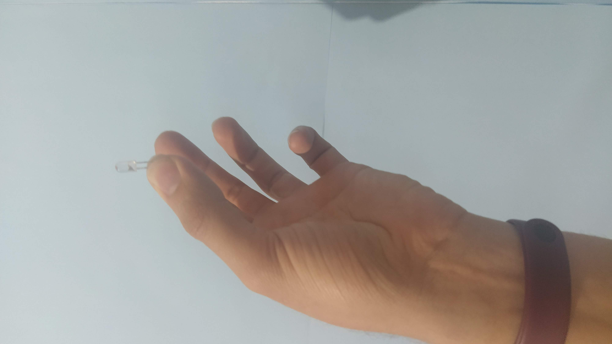 

- Chave (ligar/desligar o aparelho)
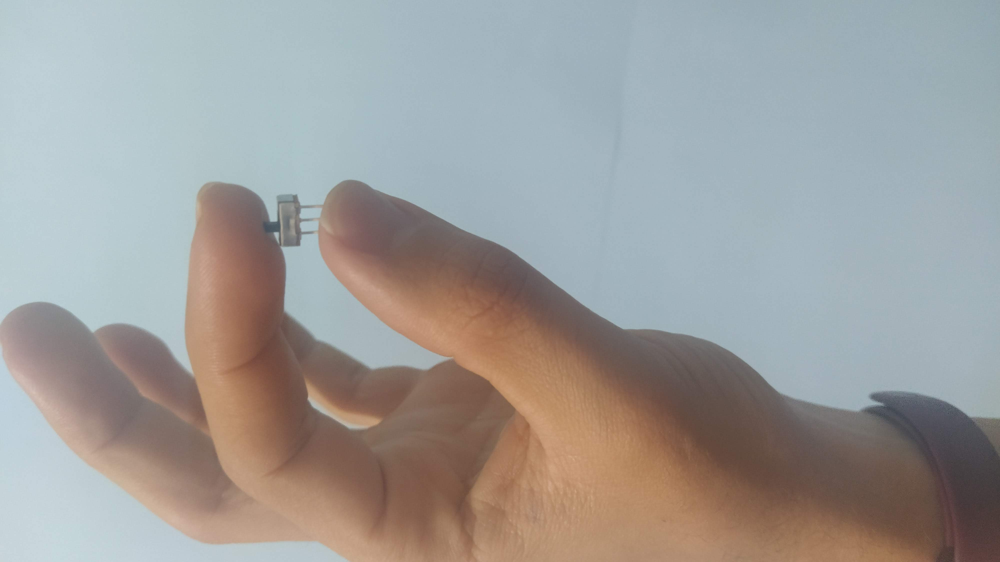 

- Protoboard (Simula circuito interno)
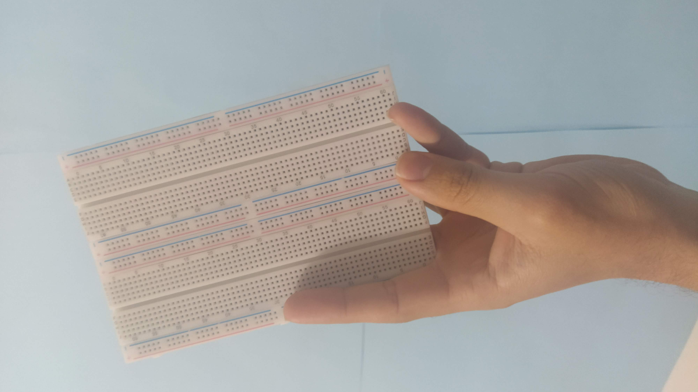 

- Nodemcu esp8266 (Recebe o código e conecta com a Eugenio controlando o dispositivo)
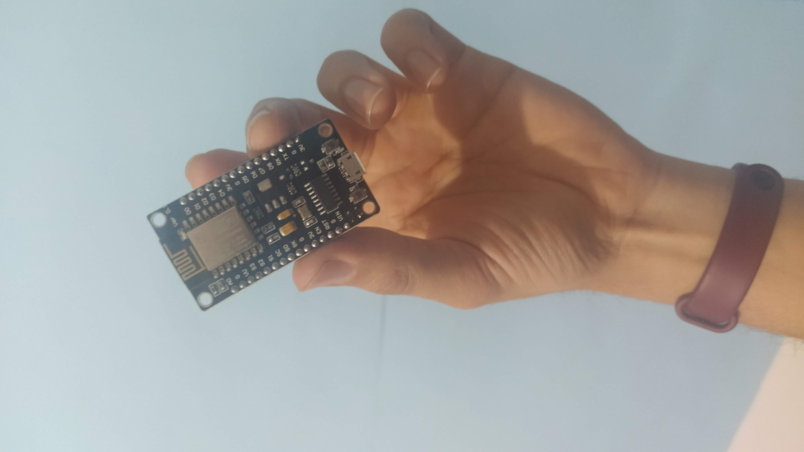 

- Caobs (Simula circuito interno)
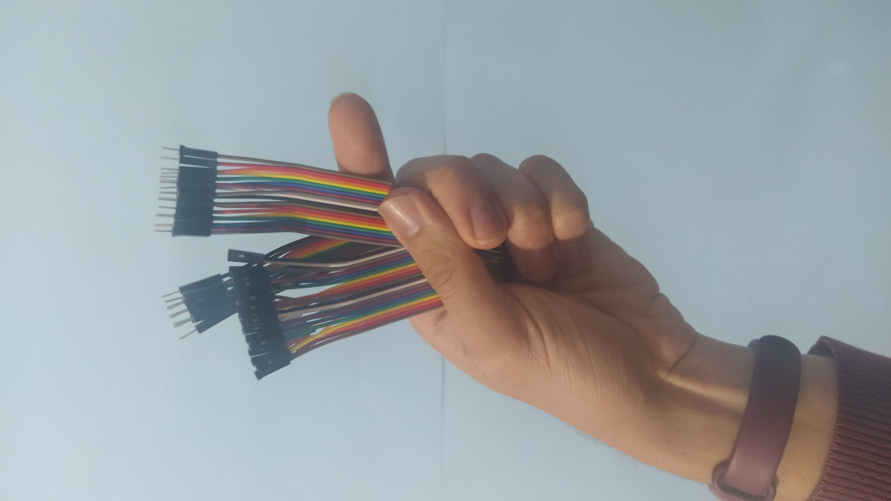

## Produção

Para a criação da estrura foi utilizada a impressão 3d, infelizmente o prazo de entrega do projeto não consegui ser alcançado para a finalização da produção.

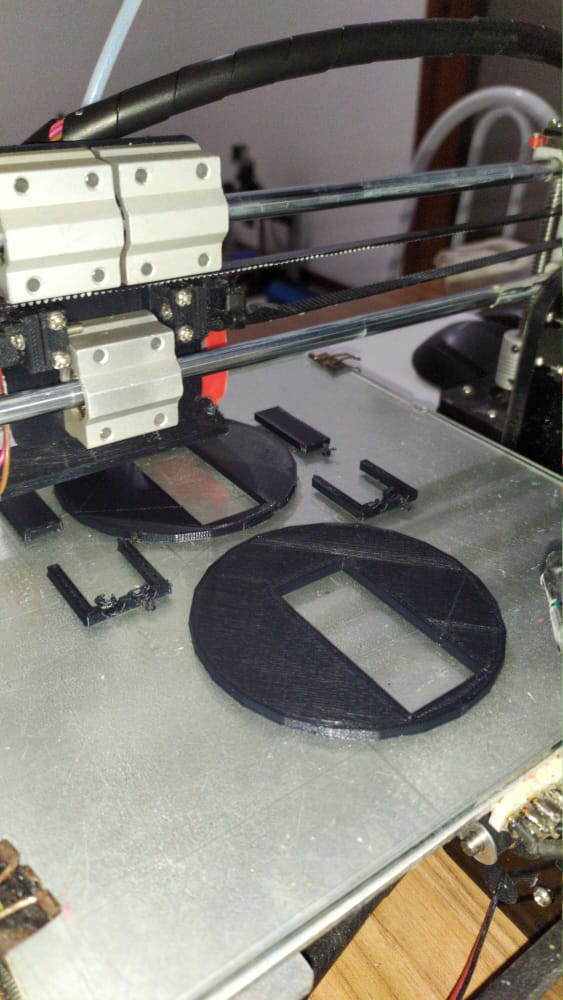
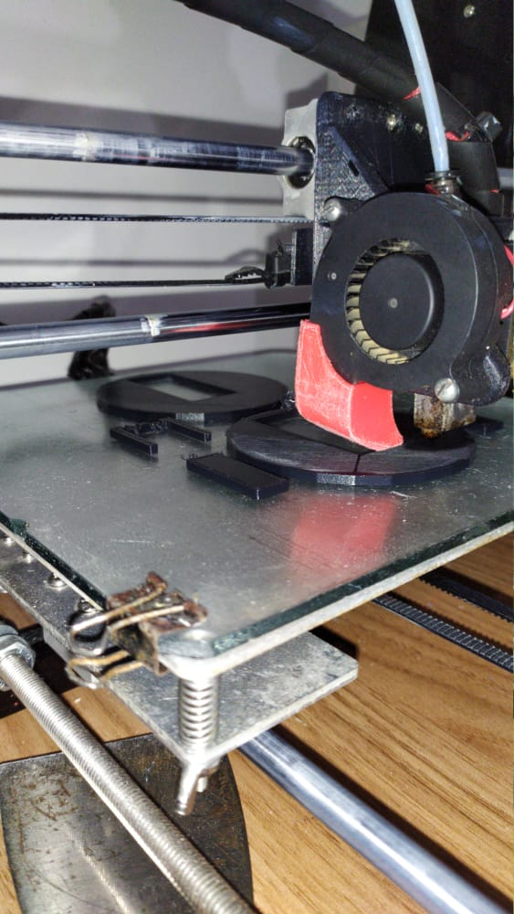
